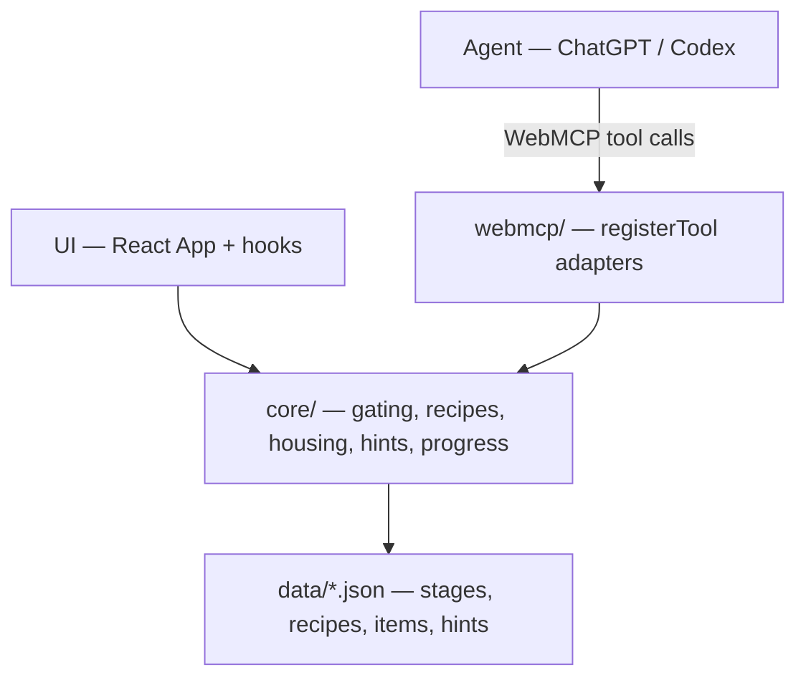

# Fog

Second-monitor companion for a progression game. You mark bosses beaten and what you're carrying. An agent talks to the page through WebMCP for craft, housing, and what's next. Later stages are not registered as tools, so the agent cannot call them.

| | |
| --- | --- |
| **Live** | https://stratagem-opal.vercel.app |
| **Repo** | https://github.com/sivaratrisrinivas/stratagem |
| **Hackathon** | [WebMCP Challenge](https://webmcp.devpost.com/) |
| **License** | MIT — [LICENSE](./LICENSE) |

Built with Vite, React, TypeScript. Static deploy on Vercel. No server, env vars, or database.

## Why WebMCP

Wikis don't know your run. Chatbots invent recipes and spoil ahead. Fog keeps recipes, housing rules, and hints on the page. Gating is code. WebMCP only exposes the unlocked slice. The agent handles messy questions; the page owns correctness and what stays locked.

```ts
await document.modelContext.registerTool({
  name: "what_can_i_craft",
  description: "List recipes unlocked at the player's stage",
  inputSchema: { type: "object", properties: {} },
  execute: async () => {
    /* core gating + recipe lookup */
  },
});
```

## Tools (11)

| Always on (8) | Stage-scoped (3) |
| --- | --- |
| `get_progress`, `set_progress`, `set_inventory`, `check_housing`, `log_discovery`, `get_discovery_log`, `load_demo_scenario`, `reset_progress` | `what_can_i_craft`, `recipe_for`, `next_step_hint` |

Stage tools register on an `AbortController`. On progress change that controller aborts and the unlocked set re-registers. Locked content is not a soft refuse — those tools are gone.

## Architecture



- **Single source of truth** — `core/progress.ts` holds stage, inventory, discoveries. UI and tools both go through core.
- **Gating in core** — not in the model. WebMCP only registers what the stage allows.
- **No backend** — static SPA. More content = more JSON rows.

Details: [docs/ARCHITECTURE.md](./docs/ARCHITECTURE.md)

## Run locally

```bash
npm ci
npm run dev
```

Open http://127.0.0.1:43123 — UI only. WebMCP needs a secure context (localhost or HTTPS).

```bash
npm run build
npm run preview
```

## Test WebMCP (judges)

Use **ChatGPT desktop** (Sol or Terra) in-app browser, or **Chrome 149+** with `chrome://flags/#enable-webmcp-testing` enabled.

1. Open https://stratagem-opal.vercel.app
2. Confirm Site tools in the address bar
3. Try:

```
Load demo scenario guide_house. Check housing and tell me what to craft.
```

Expect missing light → torch.

```
Load demo scenario post_eye_unlock. What should I do next?
```

```
Reset progress.
```

Stage craft/hint tools should lock.

Full script: [TESTING.md](./TESTING.md)

## Layout

```
src/
  webmcp/     document.modelContext.registerTool
  core/       gating, housing, recipes, hints, progress
  data/       stages, recipes, items, hints (JSON)
  hooks/      shared state for UI
  App.tsx     second-monitor UI
docs/         architecture
TESTING.md    judge prompts
LICENSE       MIT
vercel.json   static SPA
```

## Data note

Application code is MIT. Curated game reference text may follow the Terraria Wiki (CC BY-NC-SA 4.0) — see [src/data/README.md](./src/data/README.md). Unofficial fan project; not affiliated with Re-Logic.
